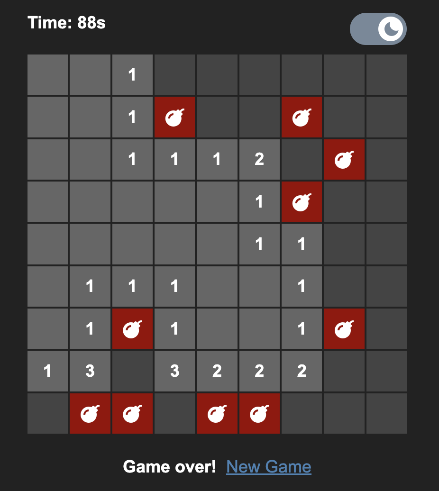

# Minesweeper in the Browser

## Features:

- Dark Mode
- Mobile Long-Press

**NOTE:** you will have to create a version.txt with the content `{int}.{int}.{int}` to build (example content: `0.0.1`). you also will need to pip install `requests`.

